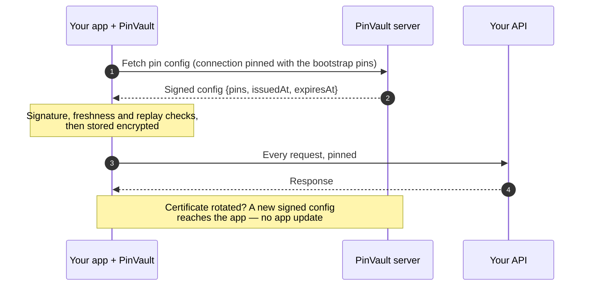

<div align="center">

# 🔐 PinVault

**Certificate pinning you can change without shipping an app update.**

Signed pins from your own server, mTLS with keys that never leave the phone,
versioned files only your devices can open, and attestation that tells your
app from a script — for Android, iOS and React Native.

[](https://central.sonatype.com/artifact/io.github.umutcansu/pinvault)
[](pinvault-ios/README.md)
[](https://www.npmjs.com/package/@umutcansu/react-native-pinvault)
[](LICENSE)

[Quick start](#quick-start) · [Features](#what-you-get) · [How it works](#how-it-works) · [Guide](GUIDE.md) · [Server](#the-server) · [Changelog](CHANGELOG.md)

</div>

---

## Why PinVault

Pinning stops a man-in-the-middle, but hard-coded pins have a cost: when the
server's certificate changes, every installed app stops working until users
update. So teams either skip pinning or live in fear of certificate renewals.

PinVault moves the pins to your server and keeps the safety:

- 📦 **Pins ship in the app only as a starting point.** After that the app
  fetches a **signed** pin list and checks the signature with a key compiled
  into the app. A server that is broken into cannot hand out pins it did not sign.
- 🔄 **Rotate certificates any time.** Add the new pin, wait for devices to pick
  it up, switch certificates. No release, no store review.
- 🛡️ **Fail closed.** No valid config, no traffic. An expired, replayed or
  downgraded config is refused; pinning never falls back to the system's trust.
- 🔌 **Server-agnostic.** Use the reference server (Docker, dashboard included),
  implement two endpoints in your own backend, or run fully offline with static pins.

> **Latest release: 2.3.2** — the iOS library and the React Native package are
> new in 2.3. See [CHANGELOG.md](CHANGELOG.md) and the upgrade notes in [MIGRATION.md](MIGRATION.md).

## What you get

| Feature | What it does |
|---|---|
| 📌 **Dynamic pinning** | Signed remote pin config, per-host versions, backup pins, issuer pins that survive leaf renewals, automatic recovery after a pin mismatch, periodic background refresh. |
| 🪪 **mTLS identity** | The device makes its own key in the Keystore / Secure Enclave and gets a certificate from a CSR. One-time tokens, one code for a whole fleet, or admin approval with a verification code. Renews itself. |
| 🗂️ **Vault files** | Remote, versioned files (ML models, feature flags, secrets): signed, encrypted at rest, optionally encrypted for one device, or locked behind the screen lock. |
| ✅ **Attestation** | Approov-style: the app reports on itself and the device, your server decides, and only a passing app gets pins and a short-lived `PinVault-Token`. Play Integrity and App Attest as optional second opinions. |
| 🧱 **Hardening** | Hardware-backed keys only, keys that work only while the phone is unlocked, pin **and** CA for public hosts, a hook for your root / jailbreak detection. |
| 🖥️ **Reference server** | Ktor + Docker with a web dashboard: pins, certificates, enrollment, vault files, audit log, two-person approval, a setup wizard that writes your app's config. |

## How it works



Prefer to watch? A [step-by-step animation](https://raw.githack.com/umutcansu/PinVault/main/docs/animation/pinvault-request-flow.en.html)
walks through every request, and there are [short films](#animation-and-films) too.

## Quick start

Pick your platform. The three libraries share the same names, the same
behaviour and the same server, so you can move between them freely.

### 1. Install

<details open>
<summary><b>Android</b> · Kotlin / Java</summary>

```kotlin
// build.gradle.kts
dependencies {
    implementation("io.github.umutcansu:pinvault:2.3.2")
}
```

minSdk 24, JDK 17, OkHttp 4. Java callers: see [the guide](GUIDE.md#2b-initialize-v2-dsl--java-consumers).

</details>

<details>
<summary><b>iOS</b> · Swift</summary>

```swift
// Package.swift — or Xcode: File → Add Package Dependencies…
.package(url: "https://github.com/umutcansu/PinVault.git", from: "2.3.2")
```

iOS 16+, Swift 6, no third-party dependencies. Info.plist keys for background
refresh and Face ID: [`pinvault-ios/README.md`](pinvault-ios/README.md#install).

</details>

<details>
<summary><b>React Native</b> · TypeScript</summary>

```bash
npm install @umutcansu/react-native-pinvault
cd ios && pod install
```

React Native 0.87+ (New Architecture). The native libraries come with the
package. On iOS register the background task in `AppDelegate`
(`PinVaultBridge.registerBackgroundTask()`); on Android there is nothing to add.
Details: [`pinvault-react-native/README.md`](pinvault-react-native/README.md#install).

</details>

### 2. Start PinVault and make a pinned request

You need three values from your server: the Config API URL, two pins of its
certificate (primary + backup), and the public key that signs configs. The
reference server's *Setup Wizard* writes this code for you.

<details open>
<summary><b>Android</b> · Kotlin</summary>

```kotlin
val config = PinVaultConfig.Builder()
    .configApi("api", "https://config.example.com/") {
        bootstrapPins(listOf(HostPin("config.example.com", listOf(PRIMARY_PIN, BACKUP_PIN))))
        signaturePublicKey(SIGNING_KEY)            // ECDSA P-256, Base64
    }
    .build()

if (PinVault.init(context, config) !is InitResult.Ready) return   // fail closed

val response = PinVault.getClient()                // an OkHttpClient
    .newCall(Request.Builder().url("https://api.example.com/v1/me").build())
    .execute()
```

Your own `OkHttpClient`? `PinVault.applyTo(builder)` adds pinning and recovery to it.

</details>

<details>
<summary><b>iOS</b> · Swift</summary>

```swift
import PinVault

let config = try PinVaultConfig.Builder()
    .configApi("api", url: "https://config.example.com/") { block in
        block.bootstrapPins([HostPin(hostname: "config.example.com", sha256: [primaryPin, backupPin])])
        block.signaturePublicKey(signingKey)
    }
    .build()

guard case .ready = await PinVault.shared.start(config: config) else { return }   // fail closed

let (data, response) = try await PinVault.shared.session()
    .data(from: URL(string: "https://api.example.com/v1/me")!)
```

Your own `URLSessionConfiguration`? `PinVault.shared.applyTo(configuration)` returns a pinned session over it.

</details>

<details>
<summary><b>React Native</b> · TypeScript</summary>

```ts
import PinVault from '@umutcansu/react-native-pinvault';

const result = await PinVault.start({
  configApis: [{
    id: 'api',
    url: 'https://config.example.com/',
    bootstrapPins: [{ hostname: 'config.example.com', sha256: [PRIMARY_PIN, BACKUP_PIN] }],
    signaturePublicKey: SIGNING_KEY,
  }],
});
if (result.type !== 'ready') return;               // fail closed

const res = await PinVault.fetch('https://api.example.com/v1/me');
```

React Native's own `fetch`, `XMLHttpRequest` and `<Image>` are pinned too. Release
builds ship the trust anchors natively and refuse to start without them unless the
app opts out: [native security file](pinvault-react-native/README.md#native-security-file).

</details>

> **Getting a pin.** A pin is the Base64 SHA-256 of the certificate's public
> key, without a `sha256/` prefix:
> ```bash
> openssl s_client -connect HOST:443 -servername HOST < /dev/null 2>/dev/null \
>   | openssl x509 -pubkey -noout | openssl pkey -pubin -outform der \
>   | openssl dgst -sha256 -binary | openssl base64
> ```

That is all pinning needs. Everything below is optional and can be switched
on one piece at a time.

## Feature tour

### 🔄 Keep pins fresh

`start` / `init` fetches the config once. Schedule a background refresh, or
refresh on demand — a pin mismatch also triggers one on its own.

<details open>
<summary><b>Android</b></summary>

```kotlin
PinVaultConfig.Builder()
    .configApi("api", url) { /* … */ }
    .updateIntervalHours(12)

PinVault.schedulePeriodicUpdates()          // WorkManager
val result = PinVault.updateNow()           // Updated / AlreadyCurrent / Failed
```

</details>

<details>
<summary><b>iOS</b></summary>

```swift
PinVaultConfig.Builder()
    .configApi("api", url: url) { block in /* … */ }
    .updateIntervalHours(12)

PinVault.shared.registerBackgroundTask()        // at launch, before it finishes
PinVault.shared.schedulePeriodicUpdates()       // BGTaskScheduler
let result = await PinVault.shared.updateNow()  // .updated / .alreadyCurrent / .failed
```

</details>

<details>
<summary><b>React Native</b></summary>

```ts
await PinVault.start({ configApis: [/* … */], updateIntervalHours: 12 });

await PinVault.schedulePeriodicUpdates();
const result = await PinVault.updateNow();  // { type: 'updated' | 'alreadyCurrent' | 'failed', … }
```

</details>

Signed configs expire (24 h by default), so someone who blocks your server
cannot keep a device on old pins for ever. How expiry, replay protection and
the device clock work: [Keeping pins fresh](GUIDE.md#keeping-pins-fresh).

### 📴 No server? Static pins

<details open>
<summary><b>Android</b></summary>

```kotlin
PinVault.init(context, PinVaultConfig.static(HostPin("api.example.com", listOf(PIN_1, PIN_2))))
```

</details>

<details>
<summary><b>iOS</b></summary>

```swift
_ = await PinVault.shared.start(config: .static(HostPin(hostname: "api.example.com", sha256: [pin1, pin2])))
```

</details>

<details>
<summary><b>React Native</b></summary>

```ts
await PinVault.start({ staticPins: { pins: [{ hostname: 'api.example.com', sha256: [PIN_1, PIN_2] }] } });
```

</details>

Several Config APIs, custom endpoint paths, or a backend with its own
protocol: [Usage modes](GUIDE.md#usage-modes).

### 🪪 Give each device its own identity (mTLS)

The device generates its key in hardware, sends a CSR, and gets a certificate
back. The private key never leaves the phone. A token is spent once; an
enrollment code can serve a whole fleet, optionally with admin approval.

<details open>
<summary><b>Android</b></summary>

```kotlin
when (val r = PinVault.enrollForResult(context, tokenFromYourBackend)) {
    is ClientCertEnrollmentResult.Enrolled -> showEnrolled()
    is ClientCertEnrollmentResult.Pending  -> showWaiting(r.verificationCode)   // admin approval
    is ClientCertEnrollmentResult.Refused  -> showError(r.reason)               // INVALID_TOKEN, REVOKED, …
    is ClientCertEnrollmentResult.Failed   -> showError(r.message)
}
```

</details>

<details>
<summary><b>iOS</b></summary>

```swift
switch await PinVault.shared.enrollForResult(token: tokenFromYourBackend) {
case .enrolled:                              showEnrolled()
case .pending(_, _, _, _, let code):         showWaiting(code)       // admin approval
case .refused(let reason, _, _, _):          showError(reason)       // .invalidToken, .revoked, …
case .failed(let message, _):                showError(message)
}
```

</details>

<details>
<summary><b>React Native</b></summary>

```ts
const r = await PinVault.enrollForResult(tokenFromYourBackend);
switch (r.type) {
  case 'enrolled': showEnrolled(); break;
  case 'pending':  showWaiting(r.verificationCode); break;   // admin approval
  case 'refused':  showError(r.reason); break;               // 'INVALID_TOKEN', 'REVOKED', …
  case 'failed':   showError(r.message); break;
}
```

</details>

Where the token comes from, enrollment codes, code-less applications,
renewal and revocation: [mTLS enrollment](GUIDE.md#mtls-enrollment).

### 🗂️ Ship files to devices

Declare a file once; PinVault downloads it over the pinned connection, checks
the server's signature, stores it encrypted, and verifies it again every time
you read it.

<details open>
<summary><b>Android</b></summary>

```kotlin
PinVaultConfig.Builder()
    .configApi("api", url) { /* … */ }
    .vaultFile("feature-flags") {
        endpoint("api/v1/vault/feature-flags")
        updateWithPins(true)                       // refresh together with the pins
    }

PinVault.fetchFile("feature-flags")
val json = PinVault.loadFileAsString("feature-flags")
```

</details>

<details>
<summary><b>iOS</b></summary>

```swift
PinVaultConfig.Builder()
    .configApi("api", url: url) { block in /* … */ }
    .vaultFile("feature-flags") { file in
        file.endpoint("api/v1/vault/feature-flags")
        file.updateWithPins(true)
    }

_ = await PinVault.shared.fetchFile("feature-flags")
let json = PinVault.shared.loadFileAsString("feature-flags")
```

</details>

<details>
<summary><b>React Native</b></summary>

```ts
await PinVault.start({
  configApis: [/* … */],
  vaultFiles: [{ key: 'feature-flags', endpoint: 'api/v1/vault/feature-flags', updateWithPins: true }],
});

await PinVault.fetchFile('feature-flags');
const json = await PinVault.loadFile('feature-flags', 'utf8');
```

</details>

#### …and lock the secret ones behind the screen lock

With `USER_AUTH` the server seals the file for this one device's key, and the
content reaches your code only after Face ID, a fingerprint or the device PIN.

<details open>
<summary><b>Android</b></summary>

```kotlin
.vaultFile("statement") {
    endpoint("api/v1/vault/statement")
    accessPolicy(VaultFileAccessPolicy.TOKEN_MTLS)
    encryption(VaultFileEncryption.USER_AUTH)
    userAuth(UserAuth.REQUIRED)
}

when (val r = PinVault.unlockFile(activity, "statement", VaultFileUnlockPrompt("Open your statement"))) {
    is VaultFileUnlockResult.Unlocked -> show(r.bytes)
    else -> Unit                                   // Cancelled, Invalidated, Stale, …
}
```

</details>

<details>
<summary><b>iOS</b></summary>

```swift
.vaultFile("statement") { file in
    file.endpoint("api/v1/vault/statement")
    file.accessPolicy(.tokenMtls)
    file.encryption(.userAuth)
    file.userAuth(.required)
}

let r = await PinVault.shared.unlockFile(key: "statement",
                                         prompt: VaultFileUnlockPrompt(title: "Open your statement"))
if case .unlocked(_, _, let bytes) = r { show(bytes) }
```

</details>

<details>
<summary><b>React Native</b></summary>

```ts
// in PinVault.start({ … }):
vaultFiles: [{
  key: 'statement', endpoint: 'api/v1/vault/statement',
  accessPolicy: 'TOKEN_MTLS', encryption: 'USER_AUTH', userAuth: 'REQUIRED',
}],

// later:
const r = await PinVault.unlockFile('statement', { title: 'Open your statement' });
if (r.type === 'unlocked') show(r.content);
```

</details>

Access policies, per-device encryption, offline lifetime and wiping files on
revocation: [VaultFile](GUIDE.md#vaultfile-remote-file-distribution) and
[SCREEN_LOCK.md](SCREEN_LOCK.md).

### ✅ Let only your genuine app in (attestation)

Turn it on for a Config API: the app attests every few minutes, and pinned
requests to your API carry a `PinVault-Token` your backend checks. A rooted
phone, a repackaged app or a script gets no token.

<details open>
<summary><b>Android</b></summary>

```kotlin
.configApi("api", url) {
    // bootstrapPins(…), signaturePublicKey(…)
    attestation()
    tokenHosts("api.example.com")
}
// optional second opinion: io.github.umutcansu:pinvault-play-integrity
```

</details>

<details>
<summary><b>iOS</b></summary>

```swift
.configApi("api", url: url) { block in
    // bootstrapPins(…), signaturePublicKey(…)
    block.attestation()
    block.tokenHosts("api.example.com")
}
// App Attest is added on its own
```

</details>

<details>
<summary><b>React Native</b></summary>

```ts
// in PinVault.start({ … }):
configApis: [{
  id: 'api', url, /* bootstrapPins, signaturePublicKey */
  attestation: true,
  tokenHosts: ['api.example.com'],
}],
```

</details>

The protocol, the policy and how your API verifies the token:
[ATTESTATION.md](ATTESTATION.md); the client side: [Attestation](GUIDE.md#attestation-approov-style).

### 🧱 Harden for production

<details open>
<summary><b>Android</b></summary>

```kotlin
PinVaultConfig.Builder()
    .requireCaTrust("api.example.com")          // pin AND a trusted public CA
    .requireHardwareBackedKeys()                // no software keys
    .requireUnlockedDevice()                    // keys usable only while unlocked
    .environmentGuard { op -> !myRasp.isCompromised() }   // your root detection
```

</details>

<details>
<summary><b>iOS</b></summary>

```swift
PinVaultConfig.Builder()
    .requireCaTrust("api.example.com")
    .requireHardwareBackedKeys()
    .requireUnlockedDevice()
    .environmentGuard { _ in !myRasp.isCompromised() }   // your jailbreak detection
```

</details>

<details>
<summary><b>React Native</b></summary>

```ts
await PinVault.start({
  configApis: [/* … */],
  requireCaTrust: ['api.example.com'],
  requireHardwareBackedKeys: true,
  requireUnlockedDevice: true,
  environmentGuard: async () => !(await myRasp.isCompromised()),
});
```

</details>

Before you ship, go through the [production security checklist](GUIDE.md#production-security-checklist).

### 📡 See what happens on the wire

Every pinned handshake, config update, certificate renewal and attestation
arrives as an event. PinVault itself never reports anywhere.

<details open>
<summary><b>Android</b></summary>

```kotlin
PinVaultConfig.Builder()
    .onConnectionEvent { event ->
        if (event is PinVaultConnectionEvent.Connection && !event.success) report(event)
    }

if (BuildConfig.DEBUG) PinVault.enableDebugLogging()   // Timber
```

</details>

<details>
<summary><b>iOS</b></summary>

```swift
PinVaultConfig.Builder()
    .onConnectionEvent { event in
        if case .connection(_, let success, _, _, _, _, _) = event, !success { report(event) }
    }

#if DEBUG
PinVault.enableDebugLogging()   // os.Logger
#endif
```

</details>

<details>
<summary><b>React Native</b></summary>

```ts
const sub = PinVault.addConnectionListener((event) => {
  if (event.type === 'connection' && !event.success) report(event);
});
// later: sub.remove()
```

</details>

More: [connection events](GUIDE.md#4-optional-subscribe-to-connection-events) and
[CONNECTION_EVENTS.md](CONNECTION_EVENTS.md).

## The server

**Use the reference server** — Ktor in Docker, with a TR/EN web dashboard and
Swagger docs:

```bash
cd demo-server
API_KEY=your-secret SIGNING_KEY_PASSWORD=second-secret KEYSTORE_PASSWORD=third-secret \
  VAULT_AT_REST_PASSWORD=fourth-secret docker compose up
```

Dashboard on `http://localhost:8080`, API docs on `/docs`, the TLS Config API
on `https://localhost:8081`. Its *Setup Wizard* lists what a production server
still lacks and writes your app's PinVault configuration. Every variable:
[demo-server/README.md](demo-server/README.md); optional governance (named
admins, two-person approval, HSM/KMS signers, webhooks):
[SECURE_OPERATIONS.md](SECURE_OPERATIONS.md).

**Or bring your own backend** — pinning alone needs two endpoints, in any
language:

1. `GET /health` → `{"status":"ok"}`
2. `GET /api/v1/certificate-config` → a signed envelope `{payload, signature}` (ECDSA P-256)

mTLS, vault files and attestation add their own endpoints:
[SERVER_IMPLEMENTATION_GUIDE.md](SERVER_IMPLEMENTATION_GUIDE.md).

## Documentation

| Read this | For |
|---|---|
| [GUIDE.md](GUIDE.md) | The full reference: every option, every check, what changed in which release |
| [pinvault-ios/README.md](pinvault-ios/README.md) · [PORTING.md](pinvault-ios/PORTING.md) | iOS specifics, and how each Android piece maps to iOS |
| [pinvault-react-native/README.md](pinvault-react-native/README.md) | The JS config shape, networking, the native security file |
| [ATTESTATION.md](ATTESTATION.md) | The attestation protocol, policy, Play Integrity and App Attest |
| [SCREEN_LOCK.md](SCREEN_LOCK.md) | Files behind the screen lock, per Android version |
| [SECURE_OPERATIONS.md](SECURE_OPERATIONS.md) | Signing keys, rotation, governance, runbooks |
| [CONNECTION_EVENTS.md](CONNECTION_EVENTS.md) | Events and the bundled reporter |
| [SERVER_IMPLEMENTATION_GUIDE.md](SERVER_IMPLEMENTATION_GUIDE.md) | The wire protocol, for your own server |
| [MIGRATION.md](MIGRATION.md) · [CHANGELOG.md](CHANGELOG.md) | Upgrading, and what changed |

## Samples

Complete apps that use every feature against one server (their READMEs are in Turkish):

| Directory | What it is |
|---|---|
| [`sample-host/`](sample-host) | The reference server in Docker, set up for phones on your LAN; `--production` starts from the hardened profile. |
| [`sample-client/`](sample-client) | Android app (Java) |
| [`sample-client-ios/`](sample-client-ios) | iOS app (SwiftUI), the same screens |
| [`sample-client-rn/`](sample-client-rn) | React Native app |
| [`sample-e2e/`](sample-e2e) | Playwright end-to-end tests on Android and the iOS simulator: an action in the dashboard is checked on the phone, and the other way round. |

## Animation and films

All silent; the text on screen carries the explanation. How to edit and
re-render them: [`docs/animation/`](docs/animation/README.md).

| What | English | Türkçe |
|---|---|---|
| Step-by-step request flow: 15 chapters, 99 steps, in any browser | [▶ open](https://raw.githack.com/umutcansu/PinVault/main/docs/animation/pinvault-request-flow.en.html) | [▶ aç](https://raw.githack.com/umutcansu/PinVault/main/docs/animation/pinvault-request-flow.tr.html) |
| Presentation (9:58): the purpose, what PinVault adds, the whole flow | [▶ watch](docs/animation/pinvault-presentation.en.mp4) | [▶ izle](docs/animation/pinvault-sunum.tr.mp4) |
| Explainer (2:49): the problem, the three layers, a certificate's lifetime | — | [▶ izle](docs/animation/pinvault-nasil-calisir.tr.mp4) |
| End to end (3:16): from the server's first start to the first protected call | — | [▶ izle](docs/animation/pinvault-bastan-sona.tr.mp4) |

## Requirements

| Platform | Minimum |
|---|---|
| Android | minSdk 24 (Android 7.0), Kotlin 1.9+ consumers, AGP 8.2, JDK 17, OkHttp 4 |
| iOS | iOS 16, Swift 6 (Xcode 16+) |
| React Native | 0.87 with the New Architecture, Hermes |

## License

Apache 2.0 — see [LICENSE](LICENSE).
